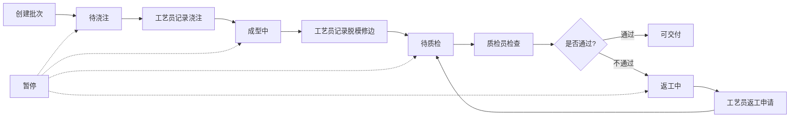
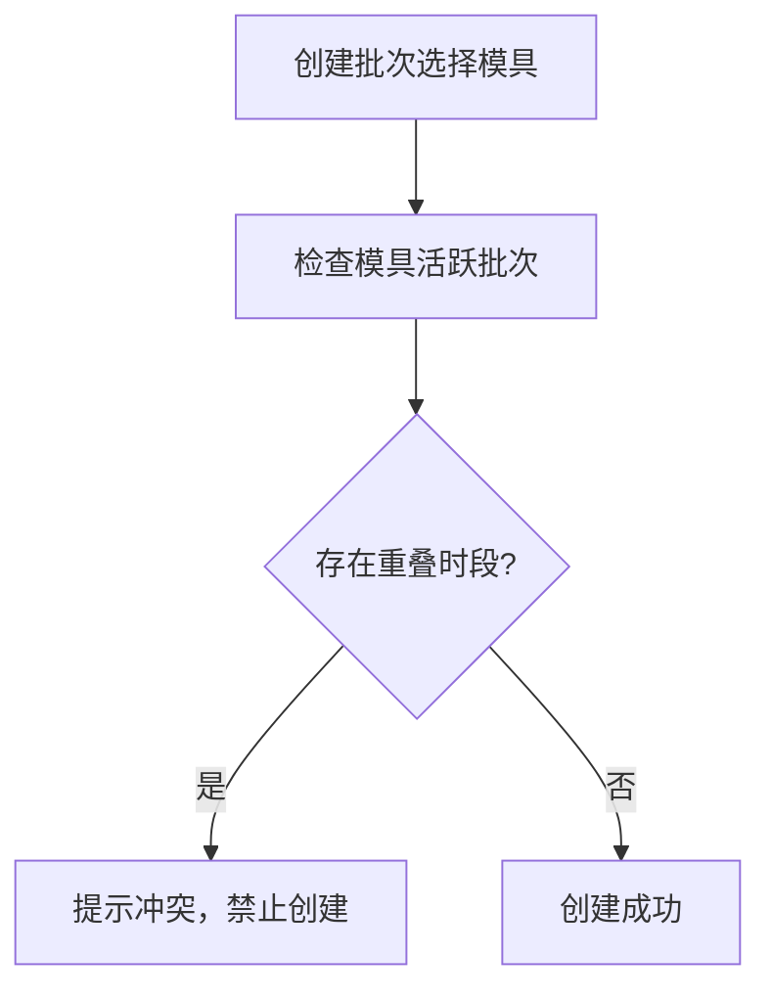

## 1. 产品概述

手作蜡模试制管理平台是一款面向精密铸造企业的全栈Web应用，用于管理蜡模款式、试制批次、气泡检查和交付判定全流程。系统通过角色分工、状态流转和智能预警，帮助企业提升蜡模试制质量和效率。

- 解决问题：传统手工记录难以追踪批次状态、模具冲突、质量趋势等问题
- 目标用户：管理员、工艺员、质检员三类角色
- 产品价值：实现试制流程数字化、质量问题可追溯、异常自动识别预警

## 2. 核心功能

### 2.1 用户角色

| 角色 | 注册方式 | 核心权限 |
|------|----------|----------|
| 管理员 | 系统初始化创建 | 维护款式、蜡料批次、成型模具、处理台位、质检周期；查看所有数据 |
| 工艺员 | 管理员创建 | 记录浇注、脱模、修边、气泡说明；提交返工申请；查看负责批次 |
| 质检员 | 管理员创建 | 记录尺寸偏差、表面平整度；出具通过意见；查看待质检批次 |

### 2.2 功能模块

1. **登录页**：角色选择登录、密码验证
2. **首页仪表盘**：批次进度、异常款式、台位负载、待质检列表、多维度筛选
3. **基础数据管理**：款式、蜡料批次、成型模具、处理台位、质检周期维护
4. **试制批次管理**：批次创建、状态流转、工艺记录、质检记录
5. **智能预警**：气泡集中识别、质检超期提醒、返工无结论追踪、款式通过率下降预警

### 2.3 页面详情

| 页面名称 | 模块名称 | 功能描述 |
|---------|----------|----------|
| 登录页 | 登录表单 | 用户名密码登录、角色自动识别、错误提示 |
| 首页 | 批次进度统计 | ECharts柱状图展示各状态批次数量 |
| 首页 | 异常款式列表 | 展示通过率下降、气泡集中的款式 |
| 首页 | 台位负载图表 | ECharts饼图展示各台位使用情况 |
| 首页 | 待质检列表 | 展示待质检批次，支持快速跳转质检 |
| 首页 | 筛选栏 | 按款式、批次、责任人、状态、日期筛选 |
| 基础数据 | 款式管理 | CRUD蜡模款式信息 |
| 基础数据 | 蜡料批次管理 | CRUD蜡料批次信息 |
| 基础数据 | 模具管理 | CRUD成型模具，支持可用性检查 |
| 基础数据 | 台位管理 | CRUD处理台位信息 |
| 基础数据 | 质检周期管理 | 设置各款式质检周期阈值 |
| 批次管理 | 批次列表 | 展示所有批次，支持状态流转 |
| 批次管理 | 批次详情 | 展示批次完整信息、工艺记录、质检记录 |
| 批次管理 | 工艺记录 | 浇注、脱模、修边、气泡说明、返工申请 |
| 批次管理 | 质检记录 | 尺寸偏差、表面平整度、通过意见 |
| 预警中心 | 预警列表 | 气泡集中、质检超期、返工无结论、通过率下降 |

## 3. 核心流程

### 3.1 批次生命周期流程

### 3.2 模具排程约束流程

## 4. 用户界面设计

### 4.1 设计风格

- **主色调**：深靛蓝 #1e3a5f（专业、稳重），搭配暖橙色 #f59e0b（工艺感、警示）
- **辅助色**：成功绿 #10b981、警告黄 #f59e0b、危险红 #ef4444、信息蓝 #3b82f6
- **按钮风格**：圆角 6px，微阴影，hover时轻微上浮效果
- **字体**：标题使用 "Noto Sans SC" 700，正文使用 "Noto Sans SC" 400，数字使用等宽字体 "JetBrains Mono"
- **布局风格**：顶部导航 + 左侧菜单 + 右侧内容区的经典管理后台布局，卡片式内容展示
- **图标风格**：使用 Element Plus 图标库，统一线性风格

### 4.2 页面设计概述

| 页面名称 | 模块名称 | UI元素 |
|---------|----------|--------|
| 首页 | 批次进度 | ECharts柱状图，渐变色填充，动画入场 |
| 首页 | 异常款式 | 卡片列表，红色角标预警，hover放大 |
| 首页 | 台位负载 | ECharts环形图，中心显示总数，色块区分 |
| 首页 | 待质检列表 | 数据表格，行悬停高亮，快捷操作按钮 |
| 首页 | 筛选栏 | 下拉选择器、日期范围选择器、重置按钮 |
| 表单页 | 通用表单 | 两列布局，标签右对齐，必填红星，错误提示 |
| 列表页 | 数据表格 | 斑马纹，固定表头，排序，分页，批量操作 |

### 4.3 响应式设计

- 桌面端优先（1920px），适配 1366px 及以上分辨率
- 侧边栏支持折叠，内容区自适应宽度
- 表格支持横向滚动，移动端优化为卡片列表
- 按钮和输入框最小尺寸 40x40px，适配触控操作

### 4.4 动效设计

- 页面加载：元素从下至上渐入，错开 delay 50ms
- 数据更新：数字滚动动画，图表重绘动画
- 状态变更：状态标签颜色渐变过渡
- 模态框：缩放 + 淡入效果
- 按钮点击：轻微缩放反馈
