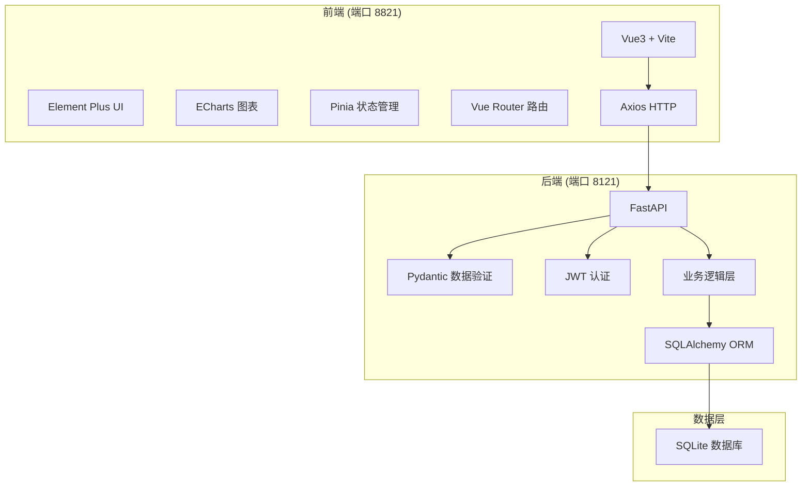
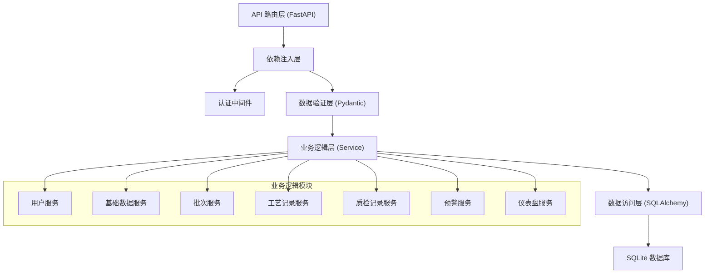
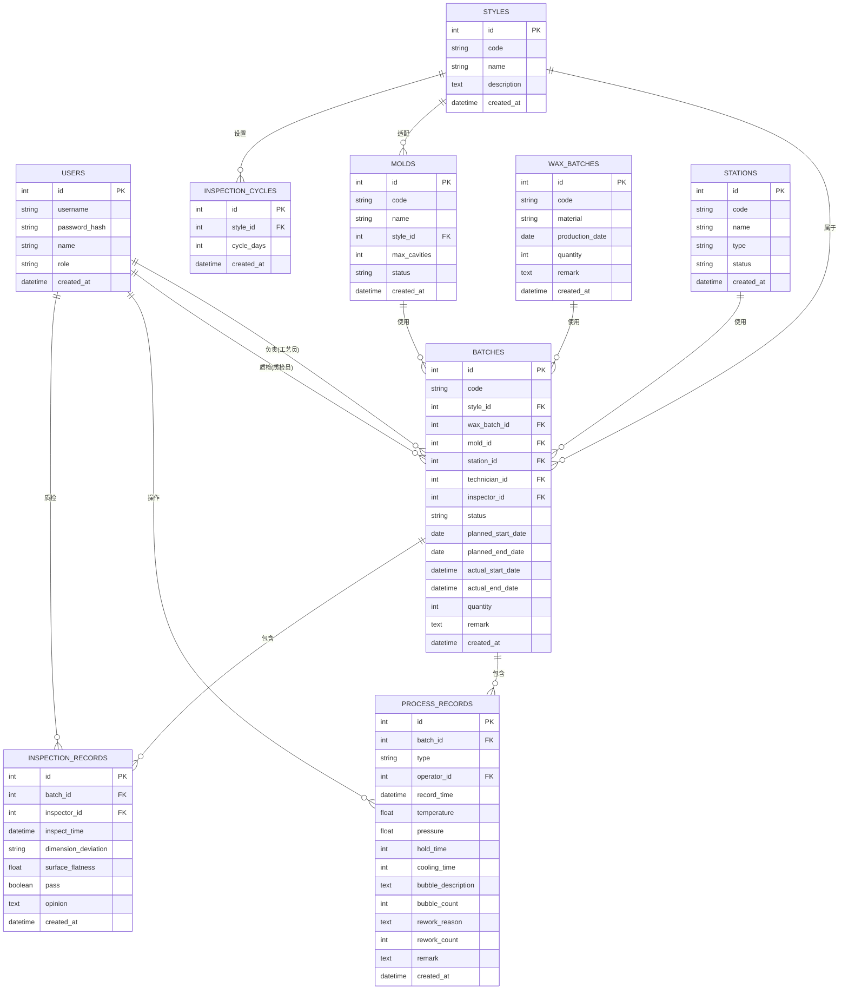

## 1. 架构设计



## 2. 技术描述

- **前端**：Vue@3.4 + Vite@5 + Element Plus@2.4 + Pinia@2.1 + Vue Router@4 + ECharts@5.4 + Axios@1.6
- **前端初始化工具**：Vite create-vue
- **后端**：FastAPI@0.104 + SQLAlchemy@2.0 + Pydantic@2.5 + PyJWT@2.8 + python-multipart@0.0.6
- **数据库**：SQLite 3，使用 SQLAlchemy ORM 进行数据操作
- **认证**：JWT Token 认证，Token 有效期 24 小时
- **接口规范**：RESTful API，统一响应格式

## 3. 路由定义

### 前端路由

| 路由路径 | 页面名称 | 权限要求 |
|---------|---------|---------|
| /login | 登录页 | 公开 |
| /dashboard | 首页仪表盘 | 所有登录用户 |
| /base-data/styles | 款式管理 | 管理员 |
| /base-data/wax-batches | 蜡料批次管理 | 管理员 |
| /base-data/molds | 模具管理 | 管理员 |
| /base-data/stations | 台位管理 | 管理员 |
| /base-data/inspection-cycles | 质检周期管理 | 管理员 |
| /batches | 批次列表 | 所有登录用户 |
| /batches/:id | 批次详情 | 所有登录用户 |
| /batches/:id/process | 工艺记录 | 工艺员、管理员 |
| /batches/:id/inspect | 质检记录 | 质检员、管理员 |
| /warnings | 预警中心 | 所有登录用户 |
| /users | 用户管理 | 管理员 |

### 后端 API 路由

| 方法 | 路径 | 说明 | 权限 |
|------|------|------|------|
| POST | /api/auth/login | 用户登录 | 公开 |
| GET | /api/auth/me | 获取当前用户信息 | 所有登录用户 |
| GET | /api/users | 用户列表 | 管理员 |
| POST | /api/users | 创建用户 | 管理员 |
| PUT | /api/users/:id | 更新用户 | 管理员 |
| DELETE | /api/users/:id | 删除用户 | 管理员 |
| GET | /api/styles | 款式列表 | 所有登录用户 |
| POST | /api/styles | 创建款式 | 管理员 |
| PUT | /api/styles/:id | 更新款式 | 管理员 |
| DELETE | /api/styles/:id | 删除款式 | 管理员 |
| GET | /api/wax-batches | 蜡料批次列表 | 所有登录用户 |
| POST | /api/wax-batches | 创建蜡料批次 | 管理员 |
| PUT | /api/wax-batches/:id | 更新蜡料批次 | 管理员 |
| DELETE | /api/wax-batches/:id | 删除蜡料批次 | 管理员 |
| GET | /api/molds | 模具列表 | 所有登录用户 |
| GET | /api/molds/available | 可用模具检查 | 所有登录用户 |
| POST | /api/molds | 创建模具 | 管理员 |
| PUT | /api/molds/:id | 更新模具 | 管理员 |
| DELETE | /api/molds/:id | 删除模具 | 管理员 |
| GET | /api/stations | 台位列表 | 所有登录用户 |
| POST | /api/stations | 创建台位 | 管理员 |
| PUT | /api/stations/:id | 更新台位 | 管理员 |
| DELETE | /api/stations/:id | 删除台位 | 管理员 |
| GET | /api/inspection-cycles | 质检周期列表 | 所有登录用户 |
| POST | /api/inspection-cycles | 创建质检周期 | 管理员 |
| PUT | /api/inspection-cycles/:id | 更新质检周期 | 管理员 |
| DELETE | /api/inspection-cycles/:id | 删除质检周期 | 管理员 |
| GET | /api/batches | 批次列表（支持筛选） | 所有登录用户 |
| GET | /api/batches/:id | 批次详情 | 所有登录用户 |
| POST | /api/batches | 创建批次 | 管理员、工艺员 |
| PUT | /api/batches/:id/status | 更新批次状态 | 工艺员、质检员、管理员 |
| POST | /api/batches/:id/pour | 记录浇注 | 工艺员、管理员 |
| POST | /api/batches/:id/demold | 记录脱模 | 工艺员、管理员 |
| POST | /api/batches/:id/trim | 记录修边 | 工艺员、管理员 |
| POST | /api/batches/:id/bubble | 记录气泡说明 | 工艺员、管理员 |
| POST | /api/batches/:id/rework | 提交返工申请 | 工艺员、管理员 |
| POST | /api/batches/:id/inspect | 记录质检结果 | 质检员、管理员 |
| GET | /api/dashboard/summary | 首页统计数据 | 所有登录用户 |
| GET | /api/dashboard/batch-progress | 批次进度数据 | 所有登录用户 |
| GET | /api/dashboard/station-load | 台位负载数据 | 所有登录用户 |
| GET | /api/dashboard/pending-inspections | 待质检列表 | 所有登录用户 |
| GET | /api/warnings | 预警列表 | 所有登录用户 |
| GET | /api/warnings/bubble-concentration | 气泡集中预警 | 所有登录用户 |
| GET | /api/warnings/overdue-inspection | 质检超期预警 | 所有登录用户 |
| GET | /api/warnings/rework-no-conclusion | 返工无结论预警 | 所有登录用户 |
| GET | /api/warnings/pass-rate-drop | 通过率下降预警 | 所有登录用户 |

## 4. API 数据定义

### 通用响应格式

```typescript
interface ApiResponse<T> {
  code: number;
  message: string;
  data: T;
}
```

### 用户相关

```typescript
interface User {
  id: number;
  username: string;
  name: string;
  role: 'admin' | 'technician' | 'inspector';
  created_at: string;
}

interface LoginRequest {
  username: string;
  password: string;
}

interface LoginResponse {
  access_token: string;
  token_type: string;
  user: User;
}
```

### 基础数据相关

```typescript
interface Style {
  id: number;
  code: string;
  name: string;
  description: string;
  created_at: string;
}

interface WaxBatch {
  id: number;
  code: string;
  material: string;
  production_date: string;
  quantity: number;
  remark: string;
  created_at: string;
}

interface Mold {
  id: number;
  code: string;
  name: string;
  style_id: number;
  max_cavities: number;
  status: 'available' | 'in_use' | 'maintenance';
  created_at: string;
}

interface Station {
  id: number;
  code: string;
  name: string;
  type: 'pour' | 'demold' | 'trim' | 'inspect';
  status: 'idle' | 'occupied' | 'disabled';
  created_at: string;
}

interface InspectionCycle {
  id: number;
  style_id: number;
  cycle_days: number;
  created_at: string;
}
```

### 批次相关

```typescript
type BatchStatus = 'pending_pour' | 'molding' | 'pending_inspect' | 'reworking' | 'deliverable' | 'paused';

interface Batch {
  id: number;
  code: string;
  style_id: number;
  wax_batch_id: number;
  mold_id: number;
  station_id: number;
  technician_id: number;
  inspector_id: number | null;
  status: BatchStatus;
  planned_start_date: string;
  planned_end_date: string;
  actual_start_date: string | null;
  actual_end_date: string | null;
  quantity: number;
  remark: string;
  created_at: string;
}

interface ProcessRecord {
  id: number;
  batch_id: number;
  type: 'pour' | 'demold' | 'trim' | 'bubble' | 'rework';
  operator_id: number;
  record_time: string;
  temperature: number | null;
  pressure: number | null;
  hold_time: number | null;
  cooling_time: number | null;
  bubble_description: string | null;
  bubble_count: number | null;
  rework_reason: string | null;
  rework_count: number | null;
  remark: string | null;
}

interface InspectionRecord {
  id: number;
  batch_id: number;
  inspector_id: number;
  inspect_time: string;
  dimension_deviation: string;
  surface_flatness: number;
  pass: boolean;
  opinion: string;
  created_at: string;
}
```

### 预警相关

```typescript
interface Warning {
  id: number;
  type: 'bubble_concentration' | 'overdue_inspection' | 'rework_no_conclusion' | 'pass_rate_drop';
  level: 'low' | 'medium' | 'high';
  title: string;
  content: string;
  related_id: number | null;
  related_type: string | null;
  created_at: string;
}
```

## 5. 服务器架构图



## 6. 数据模型

### 6.1 ER 图



### 6.2 DDL 语句

```sql
-- 用户表
CREATE TABLE users (
    id INTEGER PRIMARY KEY AUTOINCREMENT,
    username VARCHAR(50) UNIQUE NOT NULL,
    password_hash VARCHAR(255) NOT NULL,
    name VARCHAR(100) NOT NULL,
    role VARCHAR(20) NOT NULL CHECK (role IN ('admin', 'technician', 'inspector')),
    created_at DATETIME DEFAULT CURRENT_TIMESTAMP
);

-- 款式表
CREATE TABLE styles (
    id INTEGER PRIMARY KEY AUTOINCREMENT,
    code VARCHAR(50) UNIQUE NOT NULL,
    name VARCHAR(100) NOT NULL,
    description TEXT,
    created_at DATETIME DEFAULT CURRENT_TIMESTAMP
);

-- 蜡料批次表
CREATE TABLE wax_batches (
    id INTEGER PRIMARY KEY AUTOINCREMENT,
    code VARCHAR(50) UNIQUE NOT NULL,
    material VARCHAR(100) NOT NULL,
    production_date DATE NOT NULL,
    quantity INTEGER NOT NULL,
    remark TEXT,
    created_at DATETIME DEFAULT CURRENT_TIMESTAMP
);

-- 模具表
CREATE TABLE molds (
    id INTEGER PRIMARY KEY AUTOINCREMENT,
    code VARCHAR(50) UNIQUE NOT NULL,
    name VARCHAR(100) NOT NULL,
    style_id INTEGER NOT NULL,
    max_cavities INTEGER NOT NULL,
    status VARCHAR(20) NOT NULL DEFAULT 'available' CHECK (status IN ('available', 'in_use', 'maintenance')),
    created_at DATETIME DEFAULT CURRENT_TIMESTAMP,
    FOREIGN KEY (style_id) REFERENCES styles(id)
);

-- 台位表
CREATE TABLE stations (
    id INTEGER PRIMARY KEY AUTOINCREMENT,
    code VARCHAR(50) UNIQUE NOT NULL,
    name VARCHAR(100) NOT NULL,
    type VARCHAR(20) NOT NULL CHECK (type IN ('pour', 'demold', 'trim', 'inspect')),
    status VARCHAR(20) NOT NULL DEFAULT 'idle' CHECK (status IN ('idle', 'occupied', 'disabled')),
    created_at DATETIME DEFAULT CURRENT_TIMESTAMP
);

-- 质检周期表
CREATE TABLE inspection_cycles (
    id INTEGER PRIMARY KEY AUTOINCREMENT,
    style_id INTEGER NOT NULL,
    cycle_days INTEGER NOT NULL,
    created_at DATETIME DEFAULT CURRENT_TIMESTAMP,
    FOREIGN KEY (style_id) REFERENCES styles(id),
    UNIQUE(style_id)
);

-- 批次表
CREATE TABLE batches (
    id INTEGER PRIMARY KEY AUTOINCREMENT,
    code VARCHAR(50) UNIQUE NOT NULL,
    style_id INTEGER NOT NULL,
    wax_batch_id INTEGER NOT NULL,
    mold_id INTEGER NOT NULL,
    station_id INTEGER NOT NULL,
    technician_id INTEGER NOT NULL,
    inspector_id INTEGER,
    status VARCHAR(20) NOT NULL DEFAULT 'pending_pour' CHECK (status IN ('pending_pour', 'molding', 'pending_inspect', 'reworking', 'deliverable', 'paused')),
    planned_start_date DATE NOT NULL,
    planned_end_date DATE NOT NULL,
    actual_start_date DATETIME,
    actual_end_date DATETIME,
    quantity INTEGER NOT NULL,
    remark TEXT,
    created_at DATETIME DEFAULT CURRENT_TIMESTAMP,
    FOREIGN KEY (style_id) REFERENCES styles(id),
    FOREIGN KEY (wax_batch_id) REFERENCES wax_batches(id),
    FOREIGN KEY (mold_id) REFERENCES molds(id),
    FOREIGN KEY (station_id) REFERENCES stations(id),
    FOREIGN KEY (technician_id) REFERENCES users(id),
    FOREIGN KEY (inspector_id) REFERENCES users(id)
);

-- 工艺记录表
CREATE TABLE process_records (
    id INTEGER PRIMARY KEY AUTOINCREMENT,
    batch_id INTEGER NOT NULL,
    type VARCHAR(20) NOT NULL CHECK (type IN ('pour', 'demold', 'trim', 'bubble', 'rework')),
    operator_id INTEGER NOT NULL,
    record_time DATETIME NOT NULL,
    temperature FLOAT,
    pressure FLOAT,
    hold_time INTEGER,
    cooling_time INTEGER,
    bubble_description TEXT,
    bubble_count INTEGER,
    rework_reason TEXT,
    rework_count INTEGER,
    remark TEXT,
    created_at DATETIME DEFAULT CURRENT_TIMESTAMP,
    FOREIGN KEY (batch_id) REFERENCES batches(id),
    FOREIGN KEY (operator_id) REFERENCES users(id)
);

-- 质检记录表
CREATE TABLE inspection_records (
    id INTEGER PRIMARY KEY AUTOINCREMENT,
    batch_id INTEGER NOT NULL,
    inspector_id INTEGER NOT NULL,
    inspect_time DATETIME NOT NULL,
    dimension_deviation VARCHAR(500) NOT NULL,
    surface_flatness FLOAT NOT NULL,
    pass BOOLEAN NOT NULL,
    opinion TEXT NOT NULL,
    created_at DATETIME DEFAULT CURRENT_TIMESTAMP,
    FOREIGN KEY (batch_id) REFERENCES batches(id),
    FOREIGN KEY (inspector_id) REFERENCES users(id)
);

-- 索引
CREATE INDEX idx_batches_status ON batches(status);
CREATE INDEX idx_batches_style_id ON batches(style_id);
CREATE INDEX idx_batches_mold_id ON batches(mold_id);
CREATE INDEX idx_batches_created_at ON batches(created_at);
CREATE INDEX idx_process_records_batch_id ON process_records(batch_id);
CREATE INDEX idx_inspection_records_batch_id ON inspection_records(batch_id);

-- 初始化管理员账号 (密码: admin123)
INSERT INTO users (username, password_hash, name, role) VALUES 
('admin', '$2b$12$LQv3c1yqBWVHxkd0LHAkCOYz6TtxMQJqhN8/LewYGyJRXfH.5W5yK', '系统管理员', 'admin');
```
